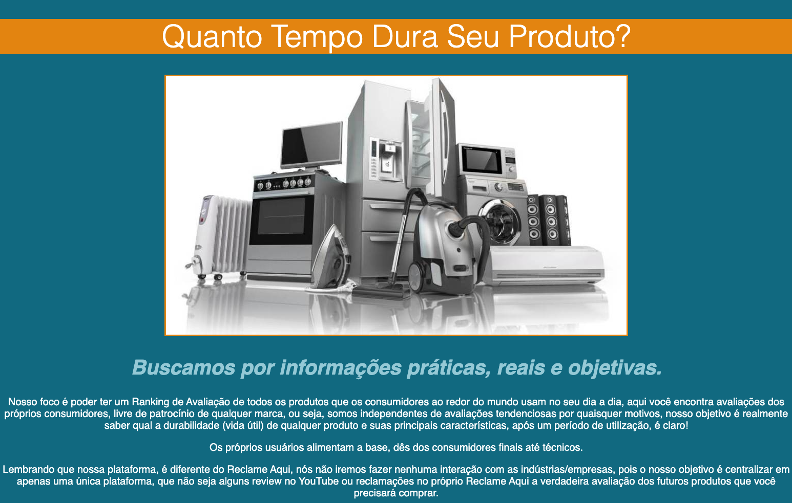

# 📈 Projeto análise de obsolescência programada em diversos produtos 
→ Planned obsolescence analysis project in several products

# 🏷 Technologies 

- [HTML](##HTML)
- [CSS](##CSS)
- [JavaScript](##JavaScript)

# 🗂 Project 

This project was developed by myself based on [Progra{m}aria](https://www.programaria.org/) classes 

PT-BR: Este projeto foi desenvolvido por mim com base nas aulas da [Progra{m}aria](https://www.programaria.org)  

- **[Online project](https://quantotempodura.biancamos.repl.co/)**

# 

Feito com 💙 by BM 

# 
👩🏻‍💻 Jun-2021 - [Progra{m}aria](https://www.programaria.org) / Eu Progr{amo} 🤓
